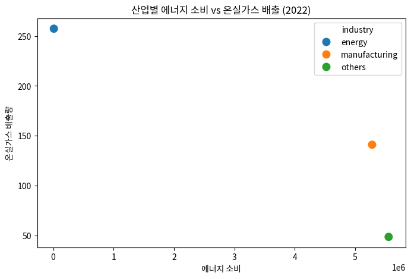
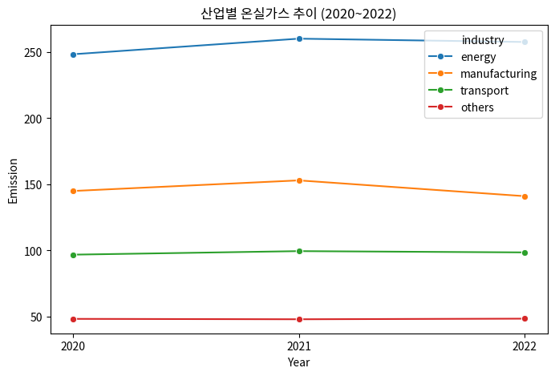

# 07. Mini Projects & Comprehensive Practice

한 노트북 안에서 여러 주제(NumPy, pandas, 시각화, 웹 스크래핑)를 함께 다루거나, 실제 공개 데이터로 분석을 진행한 종합 실습/미니 프로젝트 모음입니다.

## 학습 내용

- 여러 주차 동안 배운 NumPy/판다스/시각화/스크래핑 내용을 한 노트북에 모아 복습
- 여러 데이터셋(영화 박스오피스, 제품 판매, 성적, 기온, 분양가)을 한 세션에서 연속으로 분석
- 온실가스 배출량 데이터와 에너지 소비 통계를 병합해 산업별 탄소집약도 분석
- 검색 결과 페이지를 스크래핑해 최신 통계 수치를 가져와 시각화에 활용

## 실습 파일

| 파일 | 학습 내용 |
|---|---|
| `01_cumulative_review_numpy_pandas_scraping.ipynb` | NumPy 기초 → pandas Series/DataFrame → 웹 스크래핑까지 이어지는 대용량 누적 복습 노트북(148개 셀) |
| `02_scraping_and_multi_dataset_analysis.ipynb` | 환율 스크래핑 + 박스오피스/제품/성적/기온/분양가 데이터 분석을 한 세션에서 연습 |
| `03_mixed_topics_practice_session.ipynb` | BMI 계산(NumPy) + 배우 DataFrame + 여행사 데이터 정제/시각화 + 환율 스크래핑을 한 노트북에서 실습 |
| `04_ghg_emissions_search_scraping_and_chart.ipynb` | 온실가스 배출량 데이터 전처리 + 검색 결과 페이지 스크래핑 + 분야별 배출량 시각화 |
| `05_ghg_energy_integrated_analysis.ipynb` | 온실가스 배출량 + 국가 에너지 수급 통계를 병합해 산업별 에너지-배출량 관계와 탄소집약도 분석 |

`01`~`04`는 여러 개념을 한 세션 안에서 실습한 결과라 하나의 카테고리로 명확히 분류하기보다 "종합 실습"으로 묶었습니다. `05`는 두 개의 공개 데이터셋을 실제로 병합·분석한, 이 저장소에서 가장 완성도 있는 미니 프로젝트입니다.

## 실행 결과

- `01`, `02`, `03`, `04`는 스크래핑(실시간 웹 요청)이 포함되어 있어 **재실행하지 않고 원본 출력을 그대로 유지**했습니다.
- `05`는 외부 데이터 파일만 사용하고 스크래핑이 없어 이번 정리 작업 중 실제로 재실행하여 결과를 검증했습니다. 처음 재실행했을 때는 리눅스 정리 작업 환경에 원본 한글 폰트(Malgun Gothic)가 없어 그래프의 한글이 깨졌고, 그래프 데이터 자체도 비어 있는 문제가 있었습니다. 둘 다 아래 Troubleshooting에 정리된 대로 원인을 찾아 수정한 뒤 다시 실행/저장했습니다.

### 대표 결과

## Troubleshooting

### 1. 그래프의 한글이 깨지는 문제 (실제 발생한 오류 → 수정함)

**문제**

`05_ghg_energy_integrated_analysis.ipynb`에는 `plt.rcParams['font.family'] = 'Malgun Gothic'`이 설정되어 있는데, 이번 저장소 정리 작업에서 재실행한 리눅스 환경에는 Windows 전용 폰트인 `Malgun Gothic`이 없어 그래프의 한글 제목/축 라벨이 네모(□)로 깨져 나왔습니다.

**원인**

Matplotlib은 지정한 폰트를 찾지 못하면 오류 없이 한글 글리프가 없는 기본 폰트로 조용히 대체합니다.

**해결**

노트북 코드는 그대로 두고, 리눅스 환경에 한글을 지원하는 대체 글꼴(Noto Sans CJK KR)을 `Malgun Gothic`이라는 이름으로 등록해 재실행했습니다. `images/`의 이미지와 노트북에 내장된 실행 결과를 모두 이 방식으로 다시 생성해 교체했습니다.

### 2. 데이터 병합 결과가 항상 빈 데이터프레임이었던 문제 (코드 분석으로 발견한 실행 결과 → 수정함)

**문제**

한글 폰트 문제를 고치는 과정에서 그래프를 다시 확인해보니, 1번 그래프(에너지 소비 vs 온실가스 배출 산점도)가 축만 있고 실제 데이터 점이 하나도 없는 빈 그래프라는 것을 발견했습니다. 원인을 추적해보니 `merged = pd.merge(ghg_industry, energy_summary, on="industry")`의 결과가 항상 빈 `DataFrame`이었습니다. 이 문제는 예외(오류)를 던지지 않고 조용히 빈 결과만 만들어냈기 때문에, 앞서 "정상 실행 확인"이라고 판단했던 것은 부정확했습니다.

**원인**

`국가에너지수급통계.csv`는 `에너지흐름별(1)`~`에너지흐름별(5)`까지 5단계로 세분화된 컬럼을 갖고 있는데, 원본 코드는 "최종소비"를 찾을 때 `에너지흐름별(2)` 컬럼을 봤습니다. 하지만 실제로 "최종소비"는 `에너지흐름별(1)` 컬럼에만 존재하는 값이었습니다(`에너지흐름별(2)`에는 "산업", "수송" 등이 들어있음). 이어지는 `"산업"` 필터와 업종 매핑(`map_industry`)에 쓰인 컬럼도 마찬가지로 한 단계씩 밀려 있어서, 실제로는 존재하지 않는 조합을 찾고 있었습니다. 이 CSV는 컬럼 이름이 `에너지흐름별(1)`처럼 되어 있지만 실제 값 체계는 상위 카테고리가 하위 카테고리를 계층적으로 포함하는 구조라, 어느 컬럼이 어떤 단계를 의미하는지 실제 데이터를 열어보지 않으면 헷갈리기 쉬운 사례입니다.

추가로, 에너지 총량 컬럼을 고를 때 쓴 `energy_industry.iloc[:, 5]`도 실제로는 "총에너지"가 아니라 "석탄및석탄제품(2020년 세부 항목)" 값이었습니다. 이 CSV는 0번 행에 `총에너지`, `전기` 같은 세부 항목명이 서브헤더로 한 번 더 들어있는 2단계 헤더 구조인데, `pd.read_csv`가 이를 인식하지 못해 일반 데이터 행처럼 읽혔기 때문입니다.

**해결**

`에너지흐름별(1)` == `"최종소비"`, `에너지흐름별(2)` == `"산업"`으로 필터 컬럼을 한 단계씩 바로잡고, 업종 세부 분류가 다시 하위 항목(예: 제조업의 세부 업종)으로 중복 집계되지 않도록 `에너지흐름별(4)` == `"소계"` 조건을 추가했습니다. 총에너지 컬럼은 0번 행(서브헤더)을 직접 확인해 2022년 "총에너지" 값이 들어있는 실제 컬럼(`"2022.37"`)을 찾아 사용하도록 고쳤습니다. 코드의 계산 로직(그룹화, 병합, 시각화 방식) 자체는 그대로 두고, 잘못 지정된 컬럼 참조만 바로잡았습니다.

다만 이렇게 고친 뒤에도 "수송"(교통) 부문은 `에너지흐름별(2)`에서 `"산업"`과 같은 레벨의 별도 카테고리라, 이번에 사용한 산업별 에너지 집계에는 포함되지 않습니다. 그래서 1번(산점도)·3번(막대) 그래프는 `energy`/`manufacturing`/`others` 3개 카테고리만 표시되고, 온실가스 데이터만 사용하는 2번(꺾은선) 그래프는 원래대로 `transport`를 포함한 4개 카테고리가 모두 표시됩니다.

### 3. `UnicodeDecodeError` (재실행 중 실제로 발생한 오류 → 수정함)

**문제**

`05_ghg_energy_integrated_analysis.ipynb`를 이번에 재실행했을 때 `pd.read_csv("./data/온실가스_분야별_추이.csv")`에서 `UnicodeDecodeError: 'utf-8' codec can't decode byte 0xb1 in position 0`가 발생했습니다.

**원인**

이 CSV 파일은 UTF-8이 아니라 `cp949`(한글 Windows 기본 인코딩)로 저장되어 있는데, `encoding` 인자를 지정하지 않아 파이썬이 기본값인 UTF-8로 읽으려다 실패했습니다.

**해결**

`pd.read_csv(..., encoding="cp949")`로 인코딩을 명시해 해결했습니다. 저장소의 다른 노트북들(`08_data_cleaning_practice_housing_price.ipynb` 등)도 같은 이유로 `encoding="cp949"`를 사용하고 있어, 이번 수정은 이 저장소의 기존 관례와도 일치합니다.

### 4. `ValueError: Must have equal len keys and value when setting with an iterable` (실제 발생한 오류)

**문제**

`01_cumulative_review_numpy_pandas_scraping.ipynb`에서 `df.loc[2] = [...]`로 행을 추가한 직후 `df['소속사'] = ['SM','쿠팡','카카오']`로 새 컬럼을 만들려다 오류가 발생했습니다.

**원인**

리스트로 새 컬럼을 만들 때는 리스트의 길이가 `DataFrame`의 행 개수와 정확히 같아야 합니다. 이 시점의 `df` 행 개수와 대입하려는 리스트의 길이가 서로 맞지 않아 발생한 오류입니다.

**해결**

`len(df)`로 실제 행 개수를 먼저 확인한 뒤 그 개수에 맞는 리스트를 대입하거나, `df['소속사'] = pd.Series([...], index=[...])`처럼 인덱스를 지정해 대입하면 행 개수가 달라도 안전하게 처리할 수 있습니다.

### 예상 오류: 실시간 데이터로 인한 재현 불가능성

`02`, `03`, `04`에서 스크래핑하는 주가·환율·검색 결과는 실행하는 시점마다 값이 달라집니다. 이 저장소에 저장된 실행 결과는 실습 당시(2025년) 시점의 값이며, 지금 다시 실행하면 다른 숫자가 나오는 것이 정상입니다. 이는 오류가 아니라 실시간 데이터를 다루는 코드의 자연스러운 특성입니다.
